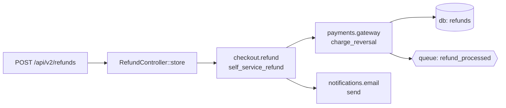

# Lattice v0.3.0 — Entry Points & Flows

Document status: design proposal, ready for review
Supersedes: the post-dogfood request to "have the structure of the artifacts
represent the logic flow of the app starting from the entry-points (HTTP
route, CLI command, scheduler/CRON job)."

---

## 1. Premise

v0.2 organises the knowledge graph around **features** — units of *meaning*.
That is the right primary axis for "what does the system know about?", but
it answers the wrong question for three other audiences:

| Reader | Question | Current answer |
|---|---|---|
| Product manager / business | "What happens when a customer does X?" | look up feature, guess at trigger |
| Security / audit | "Which routes touch the `payments` feature?" | grep |
| SRE / operator | "What runs every night at 02:00?" | read crontab + cross-reference |

v0.3 adds a **second axis**: every system has a finite set of *triggers* —
HTTP routes, CLI commands, scheduled jobs, queue workers, webhook
consumers — and each trigger reaches some subset of features through the
call graph. v0.3 makes that axis first-class.

The headline concept is the **EntryPoint**, and the headline view is
`lattice view flows` — a Mermaid flowchart from each trigger through the
features it touches.

---

## 2. The core idea: triggers, handlers, flows — three layers, three sources

| Layer | What it is | Source |
|---|---|---|
| **Trigger** | The thing that fires (HTTP `POST /api/v2/refunds`, cron `0 2 * * *`, queue `webhooks.failed`) | Per-framework static detector |
| **Handler** | The first symbol that runs when the trigger fires | Same detector links trigger → symbol FQN |
| **Flow** | The transitive set of features reached from the handler | SCIP call graph traversal |

The same split-of-concerns that worked for v0.2 applies again: **static
analysis owns trigger discovery and call-graph traversal; the LLM owns
labels; the engine fact-checks**.

- A Laravel HTTP route detector finds `Route::post('/api/refunds', ...)`,
  resolves it to `App\Http\Controllers\RefundController::store`, and emits
  one structural EntryPoint candidate. No LLM is asked "is this a route?".
- The LLM is given the entry point + its flow and asked to *name* it for
  the audience (subject to the v0.2.1 tone config) — e.g. "Customer
  requests a refund". It never invents new entry points.
- The engine then validates: each EP must reach at least one feature
  (else `UNCLASSIFIED_ENTRY_POINT`); each feature reached must really be
  on the path (else `PHANTOM_FLOW`).

---

## 3. The EntryPoint schema

```yaml
id: ep.http.api.v2.refunds.post              # dotted, by-kind namespace
version: 1
status: production
kind: http_route                              # http_route|cli|cron|queue|webhook|event_consumer|grpc
purpose: A customer requests a refund.        # LLM-labeled, tone-shaped
owners:
  business: payments
  engineering: checkout-eng
trigger:
  method: POST                                # http_route fields
  path: /api/v2/refunds
  middleware: [auth, rate_limit:60]
  # cron field:    schedule: "0 2 * * *"
  # queue field:   queue: webhooks.failed
  # cli field:     command: refunds:reconcile
handler:
  symbol: App\Http\Controllers\Api\V2\RefundController::store
  file: app/Http/Controllers/Api/V2/RefundController.php
  line: 42
flow:
  - feature: checkout.refund
    capability: self_service_refund
    via_symbols: [validateRefund, applyRefundPolicy]
  - feature: payments.gateway
    capability: charge_reversal
    via_symbols: [reverseTransaction]
  - feature: notifications.email
    capability: send
    via_symbols: [dispatch]
side_effects:
  - kind: db_write
    target: refunds
  - kind: queue_publish
    target: refund_processed
invariants_touched:                            # derived, not declared
  - checkout.refund:INV-1
  - payments.gateway:INV-3
```

Stored under `lattice/entry-points/` mirroring `lattice/features/`:

```
lattice/entry-points/
  http/api/v2/refunds/post.yaml
  cli/refunds/reconcile.yaml
  cron/nightly/cleanup.yaml
  queue/webhooks/failed.yaml
```

`lattice.json` gains an `entry_points: [...]` array and a `flows: [...]`
edge set. With sharding, entry points become their own shard:
`lattice/graph/entry_points.json`.

---

## 4. Per-framework detectors

Detection is per-framework, not per-language — Laravel and Symfony are
both PHP but find routes differently.

### v0.3.0 ships

| Framework | Kinds detected | Source patterns |
|---|---|---|
| **Laravel** (PHP) | http_route, cli, cron, queue | `Route::method(...)` in `routes/*.php` and `Modules/*/Routes/*.php`; `#[Route]` attributes; classes extending `Illuminate\Console\Command`; `$schedule->command/job/call` in console kernels; classes implementing `ShouldQueue` |

### Already prototyped for v0.3.1+

- **Symfony** (PHP) — `#[Route]` attributes, console `AsCommand`, messenger handlers
- **FastAPI / Flask** (Python) — `@app.get/post`, `@router.method`, `apscheduler` jobs, Celery `@task`
- **Express / Nest** (TypeScript) — `app.get/post`, `@Controller @Get`, BullMQ workers
- **Django** (Python) — `urls.py` URL conf, management commands, Celery beat

Each detector is a small Go file under `pkg/lattice/entrypoints/<framework>/`
implementing one interface:

```go
type Detector interface {
    Name() string
    Detect(ctx context.Context, modules []ir.Module, files func(path string) ([]byte, error)) []EntryPoint
}
```

The runner walks the workspace, asks each registered detector, dedupes
on `(kind, trigger, handler)`.

---

## 5. Flow tracing

Given an entry point's handler symbol, the flow tracer walks the call
graph until it hits a feature-annotated symbol (recording the path), an
external symbol (stopping), or the configured depth limit.

```go
type FlowTracer interface {
    Trace(handler ir.Symbol) []FlowStep
}
```

Two backends:

- **SCIP-backed** (preferred): uses the per-language SCIP index v0.1
  already builds for call-graph features. Precise — handles dynamic
  dispatch when the indexer resolves it.
- **IR-only fallback** (no SCIP): walks `ir.Symbol.References` collected
  by the adapter parser. Less precise (misses interface dispatch) but
  zero-dep, works in CI without the indexer.

Each `FlowStep` accumulates:
- `feature` (always set — the reason we stop)
- `capability` (when the reached symbol has a capability annotation or
  matches one heuristically — same matcher as v0.2.1 #6)
- `via_symbols` (the chain of intermediate non-annotated symbols between
  the previous step and this one — debugging breadcrumb, not for users)
- `branch` (when the path forks — multiple flows from one EP)

Side effects are detected during the same walk:
- `db_write` — reaches a symbol annotated `@surface(db.write)` or matches
  ORM persistence patterns (Laravel `save`/`create`/`update`/`delete` on
  an Eloquent class; SQLAlchemy `session.add/commit`).
- `http_call` — reaches a known HTTP client (Guzzle, requests, axios).
- `queue_publish` — `dispatch()` on a Job; Bull's `queue.add`; Celery's
  `.delay()`.

---

## 6. Discovery and import integration

`lattice import scan` becomes a **bi-axial** discovery:

```
  scan ──┬─▶ feature candidates (today)
         └─▶ entry-point candidates (new)
```

Both axes feed the same Stage-2 labeler. Drafts go to
`lattice/import/drafts/ep_*.yaml` alongside `cand_*.yaml`. Review and
inscribe accept both.

The LLM prompt for an entry point is grounded the same way: handler
symbol, trigger metadata, the flow's feature reaches, and the rendered
tone contract. Returns:

```json
{
  "id": "ep.http.api.v2.refunds.post",
  "purpose": "<one sentence in the configured voice>",
  "summary": "<2-3 sentences if useful>"
}
```

The LLM never invents the trigger, the handler, or the flow — only the
human-facing name.

Sidecar mode writes an `entry-point-map.yaml` alongside the existing
`annotation-map.yaml`. Inline mode inserts an `@entry_point(<id>)`
decorator/attribute above each handler (one new annotation kind).

---

## 7. CLI surface

```
lattice entrypoint list   [--kind http|cli|cron|queue] [--feature <id>]
lattice entrypoint show   <ep-id>
lattice view flows        [<ep-id>]      # mermaid flowchart per EP
lattice view entry-points                # table by kind
lattice import scan                       # same command, now bi-axial
lattice import draft                      # labels both features and EPs
lattice import review --kind entry-point  # filter the review list
```

`lattice view flows` defaults to "all EPs that reach any feature"; with
an EP id it renders just that one with full detail.

---

## 8. Validation

New rules added to the engine:

| Code | Severity | Trigger |
|---|---|---|
| `UNCLASSIFIED_ENTRY_POINT` | warning | EP reaches zero feature-annotated symbols |
| `UNREACHABLE_FEATURE` | info | A feature is reached from no entry point (often correct — internal-only feature — but worth surfacing) |
| `PHANTOM_FLOW` | error | A declared flow step references a feature that doesn't exist |
| `HANDLER_MISSING` | error | EntryPoint's handler symbol doesn't exist in the IR |
| `DUPLICATE_TRIGGER` | warning | Two EPs share the same `(kind, trigger)` — usually a routing collision |

Existing v0.1 next_action machinery applies: each violation carries a
typed remediation (`create_entry_point`, `attach_to_feature`, etc).

---

## 9. Views

### `lattice view entry-points`
Markdown table grouped by kind:

```
HTTP routes (24)
  POST  /api/v2/refunds          App\Http\...::store          → checkout.refund
  GET   /api/v2/refunds/{id}     App\Http\...::show           → checkout.refund
  ...
CLI commands (8)
  refunds:reconcile              App\Console\Commands\...     → checkout.refund, payments.gateway
  ...
Scheduled jobs (3)
  0 2 * * *  refunds:reconcile   (same command as above)
```

### `lattice view flows [<ep-id>]`
Mermaid flowchart per EP:



---

## 10. Reuse vs. new

**Reused from v0.2** (heavy reuse, this is mostly orchestration):
SCIP call graph · tree-sitter adapters · the import session and stages ·
the LLM provider + tone control · the cap-matcher (used for flow-step
capability links) · the annotation writer (new annotation kind, same
infrastructure) · the validation engine.

**Genuinely new in v0.3:**
The EntryPoint schema and persistence · per-framework detectors · the
flow tracer · the entry-points view · the flows view · the new
validation rules.

---

## 11. Phasing

- **v0.3.0-α — Schema, Laravel HTTP, basic view.** EntryPoint persists
  to disk; one detector; `lattice view entry-points` works. No flow
  tracing yet (handler is the only field populated). Useful on its own
  as "show me every HTTP surface in this Laravel app".
- **v0.3.0-β — SCIP flow tracer + `view flows`.** Flows populate;
  Mermaid view ships; new validation rules fire.
- **v0.3.0 — Multi-kind + multi-framework + import integration.** Laravel
  CLI/cron/queue. One non-Laravel detector (Express or FastAPI) to prove
  the framework matrix. `lattice import scan/draft/review/inscribe`
  treats EPs as a peer of features.

Each phase ends green against the v0.1 engine and ships independently.

---

## 12. Out of scope for v0.3.0

- Full framework matrix (Symfony, Django, Nest, Rails) — those land
  framework-by-framework in v0.3.x patches.
- Dynamic-dispatch flow resolution beyond what SCIP already handles
  (interface-method resolution is the indexer's job).
- Service-mesh / cross-process flow (gRPC-to-gRPC across repos) — a
  v0.4 idea that needs a federation story first.
- Replacing features with entry points. The two axes coexist; neither
  obsoletes the other.

---

## 13. Definition of "correct"

The v0.3 graph is correct when **all** of these hold:

1. Every `lattice validate` rule still passes (v0.1 + v0.2 + v0.3 rules).
2. Every entry point's handler symbol exists in the IR.
3. Every flow step's feature exists in the IR (no `PHANTOM_FLOW`).
4. Every accepted entry point reaches at least one feature (no
   `UNCLASSIFIED_ENTRY_POINT` errors — warnings are allowed during
   incremental adoption).
5. Re-running `lattice extract` on unchanged code reproduces the same
   entry-point set byte-for-byte (determinism, same guarantee v0.1 made
   for features).
